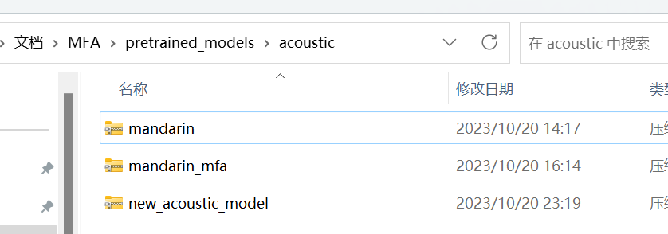
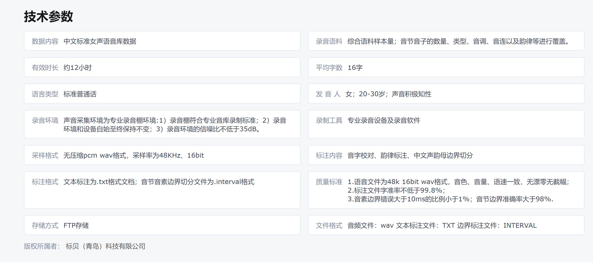
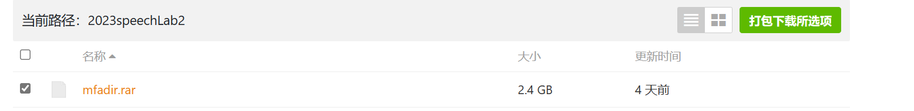
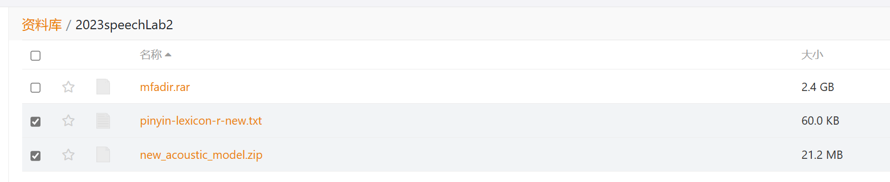

# **任务二：基于HMM的强制对齐实验**

##### **课上检查+实验报告（记录实验步骤+回答问题）**

### **问题背景**

Montreal Forced Aligner（MFA）[[1\]](https://montreal-forced-aligner.readthedocs.io/en/latest/index.html)是一个用于将音频和文本进行对齐的工具。它可以用于语音识别、语音合成和发音研究等领域。它也是隐马尔可夫模型（HMM）的一个典型应用。MFA支持多种语言和语音，用户可以根据需要自定义训练模型。

### **MFA安装**

MFA 支持 Windows、macOS 和 Linux 操作系统。Kaldi和MFA现在已经构建在Conda Forge上，因此从2.0.0b4开始，第三方二进制文件的安装完全通过conda进行。通过conda安装MFA将同时安装Kaldi。

在本次实验中，推荐大家使用**conda**安装。

使用windows的同学推荐可以使用wsl或者powershell进行操作。[wsl](https://learn.microsoft.com/zh-cn/windows/wsl/install)可以参考安装文档，然后在wsl中安装conda环境。也可以在powershell中直接安装conda环境.

### **使用conda安装MFA**

1. 安装/[Conda](https://docs.conda.io/projects/miniconda/en/latest/)
2. 创建新环境并安装MFA（这部分可能比较慢，需要等待）

```
#第一种安装方法
#  创建新环境并同时安装MFA，命令如下：
conda create -n aligner -c conda-forge montreal-forced-aligner
# -n aligner 为环境名称，可以自定义修改。
# -c conda-forge 启用conda forge通道，
# 可以通过预先执行conda config --add channels conda-forge指令默认启用。
# montreal-froced-aligner 为安装MFA的参数。
#
#第二种安装方法
#  也可以先创建环境再安装MFA，命令如下：
conda create -n aligner
conda activate aligner 
conda install montreal-forced-aligner -c conda-forge
```

​	3.进入环境

```
conda activate aligner 
# aligner为环境的名称
```

更多安装途径请查看[官网教程](https://montreal-forced-aligner.readthedocs.io/en/latest/installation.html)。


安装后，MFA的文件路径为

```
User/Documents/MFA
```

以windows系统为例，MFA文件路径在




### **数据集介绍**

#### **【**[**中文标准女声音库**](https://www.data-baker.com/data/index/TNtts/)**】**

采集对象的音色风格知性阳光、亲切自然，专业标准普通话女声，听感乐观积极。录制环境为专业录音室和录音软件，录音环境和设备自始至终保持不变，录音环境的信噪比不低于35dB;单声道录音，用48KHz 16比特采样频率、pcm wav格式。录音语料涵盖各类新闻、小说、科技、娱乐、对话等领域，语料设计综合语料样本量，力求在有限的语料数据量内，对音节音子、类型、音调、音连以及韵律等尽可能全面的覆盖。根据合成语音标注标准对音库进行文本音字校对、韵律层级标注、语音文件边界切分标注。



### **数据集处理**

数据集中提供了音节音素边界切分文件，但是未提供拼音和音素对应的词典，因此无法直接用于不同语音任务的模型训练，因此我需要使用MFA以及新的词典文件来生成包含语音边界切分信息的textgrid文件。

MFA对于处理的语音数据集有着如下的格式要求：

```
+-- prosodylab_corpus_directory
|   +-- speaker1
|       --- recording1.wav
|       --- recording1.lab
|       --- recording2.wav
|       --- recording2.lab
|   +-- speaker2
|       --- recording3.wav
|       --- recording3.lab
|   --- ...
```

其中，.wav文件为数据集中的语音文件，.lab文件为语音文件对应的文本，其中文本的语言应与你使用的声学模型所能识别的文本以及词典文件中的语言相一致。如：声学模型所识别的文本为汉字，而你的语言文件说的内容为“我爱你”，则你的.lab文件中应存储着“我爱你”的文本，若是声学模型识别的文本为拼音，则.lab文件中应为“wo3 ai4 ni3“，同时词典文件中也应有着汉字-音素或者拼音-音素的对应信息。

对数据集的处理需要写脚本处理生成，此处就不过多赘述，重点还是要保证声学模型、词典、lab文件中语言的一致。

这里提供生成好的数据集文件。

https://cloud.tsinghua.edu.cn/d/ed86924e88e14023901a/



### **预训练模型**

MFA需要一个声学模型来建模语音单元，声学模型通常是使用大量标记的语音数据进行训练的。然而，使用传统方法训练一个声学模型需要大量的时间和计算资源，因此，通常会使用预训练模型来加速模型的训练。这些预训练模型通常是在大量标记的语音数据上训练得到的，并且可以用于各种不同的语音处理任务。

MFA支持使用不同的预训练模型，这些模型在不同的语音数据集上进行训练，并且具有不同的声学特征。用户可以选择适合自己的预训练模型来进行韵律分析。

MFA提供了许多预训练模型，包括声学模型、字音转换（G2P）模型、语言模型以及这些模型所支持的词典。

本次实验要用到的声学模型和对应的词典已经上传到网盘

https://cloud.tsinghua.edu.cn/d/ed86924e88e14023901a/



其中，pinyin-lexicon-r-new.txt为词典，里面包含拼音-音素的对应信息。

new_acoustic_model.zip是声学模型，能够对音频进行声学分析。

将new_acoustic_model.zip放在 /MFA文件目录/pretrained_models/acoustic（整个zip放进去，不用解压)

例如


### **对齐过程**

准备好数据集、预训练的声学模型以及对应的词典文件，我们就可以对数据集进行文本-音频对齐

#### **验证**

验证使用的声学模型和词典能否用于对齐这个数据集，所花时间可能较长，但是会将对齐过程需要的中间文件生成。也可直接跳过此步直接进行对齐。

```
mfa validate path:/dataset path:/dictionary path:/acoustic_modle
#例如 mfa validate mfadir pinyin-lexicon-r-new.txt new_acoustic_model
```

#### **对齐**

```
mfa align /path:/dataset path:/dictionary path:/acoustic_modle path:/output
#例如 mfa align mfadir pinyin-lexicon-r-new.txt new_acoustic_model output
```

对齐生成的中间文件在

/MFA文件目录/mfadir

对齐生成的结果在path:/output中

## **QA**

1.如果align报错，可以把MFA文件目录的mfadir删除，再重新align一下。

2.tips:如果觉得全量数据集跑起来很慢，可以用一两条数据进行调试，成功了再用全量数据集。

3.如果之前已经安装过mfa（推荐使用conda版本）

如果之前使用的是非conda版本的MFA，并且想要升级到使用conda版本的MFA，需要首先删除之前安装的非conda版本的MFA，然后根据上述指南，使用conda安装最新版本的MFA。请注意，这可能会影响在非conda版本MFA上保存的任何个人设置或数据。

a. 安装conda，创建环境并激活你的环境

```
conda create -n aligner
conda activate aligner 
```

b. 更新所有的packages

```
conda update --all
```

c.通过pip卸载之前的MFA（如果未安装则不用）

```
pip uninstall montreal-forced-aligner
```

d.通过conda安装MFA

```
conda install -c conda-forge montreal-forced-aligner
```

## **问题**

1.（课上检查6分，实验报告6分）课上检查实验结果，检查内容:MFA是否安装成功; MFA align生成的中间文件；MFA align生成的textgrid。实验报告中记录实验过程。

2.（文本内容分析3分，结合波形、频谱、基频分析6分）分析最后生成的textgrid的文本内容，并结合音频的波形、频谱、基频进行分析。（用pratt或者audition之类的可以查看音频波形图的软件, pratt同时打开wav和textgrid一起选中，然后view&edit就行）

3.（3分）如何使用HMM（隐马尔可夫模型）在MFA中进行音素对齐？

4.（3分）在MFA中，HMM的训练过程是如何进行的，以及如何利用训练好的HMM模型进行音素级别的对齐？

5.（3分）在MFA中，如何根据HMM模型调整参数以优化音素对齐的准确性？针对所选择的参数写明理由即可，可以通过HMM模型的概念出发。

附加题一（选做）（上限3分）：官网下载标贝女声数据集，自己生成MFA数据集文件，提供脚本代码截图以及运行结果截图。

附加题二（选做）（上限10分）：如何改进对齐结果？这是个开放的问题，需要附上实验，用pratt说明改进后的textgrid比原来的textgrid好即可。（比较难）

